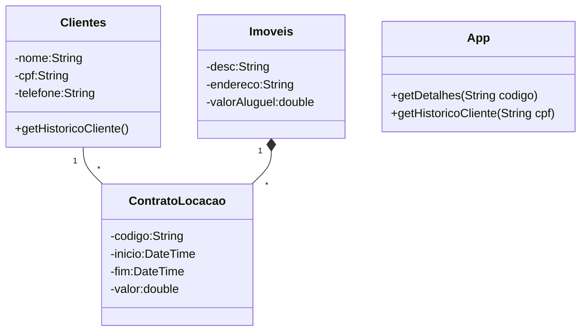

```mermaid
classDiagram
    class Clientes{
        -nome:String
        -cpf:String
        -telefone:String
        +getHistoricoCliente()
    }
    class Imoveis{
        -desc:String
        -endereco:String
        -valorAluguel:double
    }
    class ContratoLocacao{
        -codigo:String
        -inicio:DateTime
        -fim:DateTime
        -valor:double
    }
    class App{
        +getDetalhes(String codigo)
        +getHistoricoCliente(String cpf)
    }
    
    Clientes "1" -- "*" ContratoLocacao
    Imoveis "1" *-- "*" ContratoLocacao

    
```