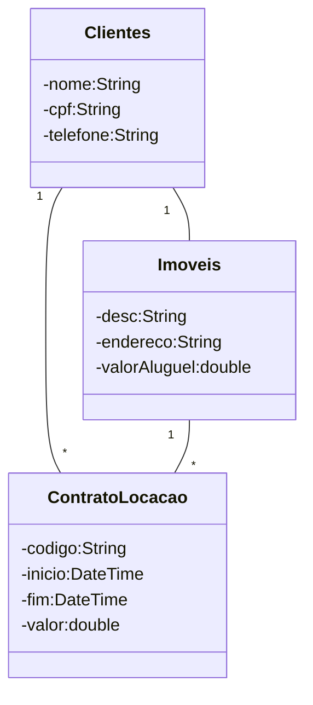

```mermaid
classDiagram
    class Clientes{
        -nome:String
        -cpf:String
        -telefone:String
    }
    class Imoveis{
        -desc:String
        -endereco:String
        -valorAluguel:double
    }
    class ContratoLocacao{
        -codigo:String
        -inicio:DateTime
        -fim:DateTime
        -valor:double
    }
    Clientes"1"--Imoveis
    Clientes"1"--"*"ContratoLocacao
    Imoveis"1"--"*"ContratoLocacao
    
```